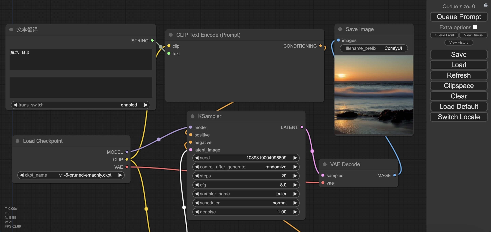

# ComfyUI-Prompt-Translator
ComfyUI 通过语言模型自动翻译 Prompt 为中文提示词插件。  
它基于模型 [facebook/mbart-large-50-many-to-many-mmt](https://huggingface.co/facebook/mbart-large-50-many-to-many-mmt)，使用了 Hugging Face 的 Transformers 库来实现翻译功能。  
该翻译插件不需要联网翻译，只需要下载翻译模型就可以正常工作。  

## 安装插件
```
cd ComfyUI/custom_nodes
git clone https://github.com/MofaAI/ComfyUI-Prompt-Translator.git
```

## 语言模型下载
```
pip install -U huggingface_hub hf_transfer
export HF_ENDPOINT=https://hf-mirror.com
huggingface-cli download --resume-download huggingface-cli download --resume-download
```

## 使用效果



